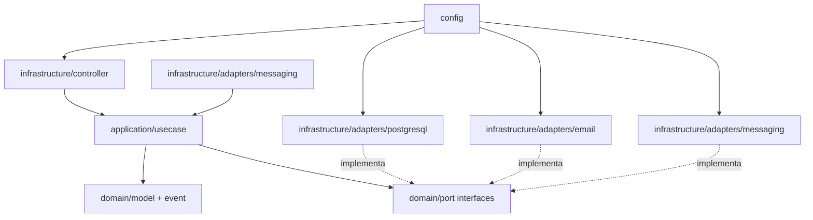
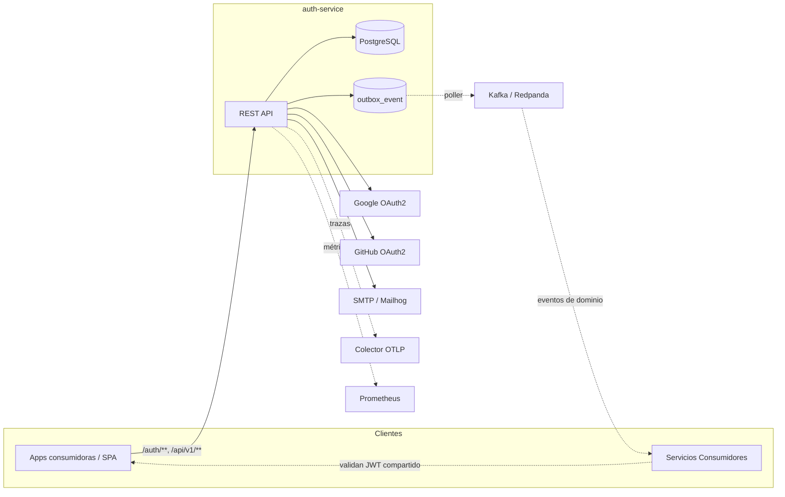
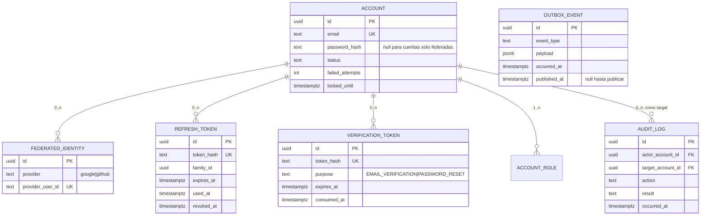

# Architecture Spine — auth-service

## Design Paradigm

**Clean Architecture / hexagonal estricta** — regla de dependencia unidireccional hacia adentro: `infrastructure → application → domain`, nunca al revés. Cuatro zonas bajo `com.auth_service.auth`:

- `domain/` — el núcleo: modelos, value objects, eventos de dominio, excepciones, **ports** (interfaces de repositorio y gateway). Java puro — cero Spring, cero JPA, cero SDKs externos.
- `application/` — casos de uso: una clase por capability del PRD, orquesta `domain/` a través de sus ports. Único lugar donde vive `@Transactional` — trade-off deliberado: casos de uso 100% framework-free obligarían a gestión manual de transacciones sin beneficio real a esta escala [ASSUMPTION: pragmatismo aceptado, ver AD-13].
- `infrastructure/` — **adapters**: entrada (`controller/` REST) y salida (`adapters/postgresql/`, `adapters/email/`, `adapters/oauth/`, `adapters/messaging/`).
- `config/` — composición: Spring Security, beans, propiedades tipadas, wiring de casos de uso a adapters.



## Invariants & Rules

### AD-1 — El dominio no depende de frameworks de infraestructura

- **Binds:** all
- **Prevents:** lógica de negocio acoplada a JPA/web que impide testear sin contenedor y duplica modelos a medias.
- **Rule:** ningún tipo en `domain/` importa `jakarta.persistence.*`, `org.springframework.*`, ni SDKs de proveedores. Las entidades JPA viven en `infrastructure/adapters/postgresql/` y se mapean a modelos de dominio. `domain/` es Java puro (endurecido respecto a la versión anterior: Spring ya no se permite ni siquiera en servicios — esa responsabilidad pasa a `application/`, ver AD-13).

### AD-2 — Punto único de emisión de tokens

- **Binds:** FR-3, FR-4, FR-6
- **Prevents:** que el login con credenciales y el login OAuth2 emitan tokens con claims/formatos divergentes.
- **Rule:** todo par Access+Refresh se emite exclusivamente por `TokenIssuer` (`application/usecase`). El success handler de OAuth2 delega en el mismo caso de uso que el login con credenciales; nadie más construye JWTs.

### AD-3 — Access Token stateless HS256; claims fijas

- **Binds:** FR-3, FR-4, FR-10, FR-11, Servicios Consumidores
- **Prevents:** validaciones incompatibles entre consumidores y esquemas de claims ad-hoc.
- **Rule:** Access Token = JWT firmado **HS256** con secreto de ≥256 bits (AD-19) [ADOPTED — README; RS256/JWKS diferido]. Claims: `sub` = UUID de la Cuenta, `email`, `roles` (array de strings), `iat`, `exp`, `iss="auth-service"`. Nunca se persiste ni se revoca individualmente; TTL 15 min [ASSUMPTION].

### AD-4 — Refresh Token opaco, hasheado, rotación con detección de reuso por familia

- **Binds:** FR-4, FR-5, FR-7, FR-11
- **Prevents:** refresh tokens re-emitibles tras un robo y revocaciones parciales inconsistentes.
- **Rule:** el Refresh Token es un valor aleatorio opaco (no JWT). En BD se guarda **solo su hash SHA-256**, con `family_id`, `expires_at` (7 días [ASSUMPTION]), `used_at`, `revoked_at`. Canje marca `used_at` y emite sucesor en la misma familia; canje de un token con `used_at`/`revoked_at` no nulo revoca la familia completa. Logout, restablecimiento de contraseña (FR-7) y desactivación (FR-11) revocan **todas** las familias de la Cuenta.

### AD-5 — Credenciales y tokens de un solo uso nunca en claro

- **Binds:** FR-1, FR-2, FR-7
- **Prevents:** filtración de secretos ante un dump de BD o de logs.
- **Rule:** contraseñas con BCrypt (`DelegatingPasswordEncoder` de Spring, default). Tokens de Verificación: valor aleatorio enviado por email, **hash SHA-256 en BD**, un solo uso, TTL 24 h (verificación) / 1 h (recuperación) [ASSUMPTION]. Prohibido loggear contraseñas, tokens o JWTs completos.

### AD-6 — Mutación de estado solo a través de casos de uso transaccionales

- **Binds:** all
- **Prevents:** transiciones del estado de Cuenta esparcidas por controllers/handlers que rompen la máquina de estados.
- **Rule:** los controllers no contienen lógica de negocio ni tocan repositorios; toda mutación pasa por un caso de uso de `application/` (ver AD-13). Las transiciones de estado de Cuenta (`PENDING_VERIFICATION → ACTIVE`, `ACTIVE ⇄ LOCKED`, `* → DISABLED`) viven únicamente ahí, nunca en `domain/model` (que expone las transiciones válidas como método pero no decide cuándo invocarlas) ni en `infrastructure/`.

### AD-7 — Esquema propiedad de Flyway

- **Binds:** all
- **Prevents:** esquemas divergentes entre entornos y drift silencioso de Hibernate.
- **Rule:** migraciones versionadas Flyway en `db/migration` (`V<n>__<desc>.sql`); `spring.jpa.hibernate.ddl-auto=validate` en todos los perfiles. Nadie modifica esquema fuera de una migración.

### AD-8 — Errores RFC 7807 y anti-enumeración

- **Binds:** all endpoints
- **Prevents:** formatos de error distintos por controller y respuestas que filtran existencia de cuentas.
- **Rule:** toda respuesta de error es `application/problem+json` (Problem Details, soporte nativo Boot 3) generada por un `@RestControllerAdvice` único. Login fallido, registro con email existente y solicitud de recuperación responden mensajes genéricos indistinguibles (PRD FR-1/FR-3/FR-7); el detalle real va solo a logs.

### AD-9 — Email detrás de un port, fuera de la transacción

- **Binds:** FR-2, FR-7, FR-9
- **Prevents:** que un SMTP caído rompa el registro y que la lógica dependa de un proveedor concreto.
- **Rule:** el dominio expone el port `EmailSender`. El envío se dispara tras el commit (evento de aplicación / `@TransactionalEventListener`) — el fallo de envío no revierte la operación. Perfil `dev`: adapter que loggea a consola o Mailhog; `prod`: SMTP real (pregunta abierta 1 del PRD), protegido por AD-17.

### AD-10 — Configuración solo por entorno; propiedades tipadas

- **Binds:** all
- **Prevents:** secretos en el repo y strings mágicos de configuración.
- **Rule:** parámetros por variables de entorno (contrato del README: `DB_*`, `GOOGLE_*`, `GITHUB_*`; se añaden `AUTH_ADMIN_EMAIL`, `AUTH_ADMIN_PASSWORD`, `AUTH_LOCKOUT_*`, TTLs, `MAIL_*`, `APP_BASE_URL`, `KAFKA_BOOTSTRAP_SERVERS` [ASSUMPTION]; secretos vía AD-19). Se consumen vía `@ConfigurationProperties` (records), nunca `@Value` disperso. Perfiles: `dev` y `prod`.

### AD-11 — Seguridad por defecto: deny-all

- **Binds:** FR-10, FR-11, all endpoints
- **Prevents:** endpoints nuevos accidentalmente públicos.
- **Rule:** la `SecurityFilterChain` termina en `anyRequest().authenticated()`; lo público (`/auth/**`, `/oauth2/**`, `/error`, docs OpenAPI [ASSUMPTION]) se lista explícitamente. Los endpoints de `/actuator/**` (AD-16) **nunca** están en esa lista pública — se exponen solo en un puerto/interfaz de management separado o tras autenticación de infraestructura. Autorización por rol con `@PreAuthorize("hasRole('ADMIN')")` en los endpoints de FR-11/FR-13. Sesión stateless (`SessionCreationPolicy.STATELESS`), CSRF deshabilitado por ser API sin cookies de sesión.

### AD-12 — Regla de dependencia enforced mecánicamente (ArchUnit)

- **Binds:** all
- **Prevents:** que AD-1/AD-6/AD-13 degraden a convención de facto, violada silenciosamente a medida que el equipo crece.
- **Rule:** un test ArchUnit (`ArchitectureRulesTest`, `application/usecase`, dominio no depende de infraestructura) corre en cada build y **rompe el pipeline** si `domain/` importa `application/` o `infrastructure/`, si `application/` importa `infrastructure/`, o si aparece un ciclo entre paquetes. Es parte del gate de calidad (AD-21), no opcional.

### AD-13 — Casos de uso como frontera de aplicación transaccional

- **Binds:** all FRs
- **Prevents:** lógica de orquestación dispersa entre controllers y "servicios de dominio" ambiguos; transacciones abiertas en la capa equivocada.
- **Rule:** cada capability del PRD se implementa como una clase `application/usecase/*UseCase` (una responsabilidad por caso de uso: `RegisterAccountUseCase`, `LoginUseCase`, `RefreshTokenUseCase`, etc.), anotada `@Transactional`, que orquesta `domain/model` a través de los ports de `domain/port`. Reemplaza los antiguos `domain/service/*Service` de la versión previa del spine.

### AD-14 — Value Objects para invariantes de dominio

- **Binds:** FR-1, FR-3, FR-7, all
- **Prevents:** estado inválido representable (email malformado, contraseña en claro deambulando como `String` por firmas de métodos).
- **Rule:** `Email`, `HashedPassword`, `AccountId` son `record` inmutables en `domain/model` que validan invariantes en construcción (fail-fast) y son los únicos tipos que cruzan la frontera de `application/` para esos conceptos.

### AD-15 — Domain Events + outbox transaccional para integración con el ecosistema

- **Binds:** FR-1, FR-2, FR-6, FR-9, FR-11 — eventos: `AccountRegistered`, `AccountVerified`, `AccountLocked`, `AccountDisabled`, `TokenFamilyRevoked`
- **Prevents:** Servicios Consumidores haciendo polling sobre el estado de Cuenta; eventos que se pierden si el broker está caído en el instante de la mutación (problema de doble escritura).
- **Rule:** cada mutación relevante de `Account` produce un Domain Event inmutable (`domain/event`, Java puro) que el caso de uso persiste **en la misma transacción de negocio** en `outbox_event` (patrón Transactional Outbox). Un publicador (`infrastructure/adapters/messaging`, poller programado) relee la tabla y publica a Kafka de forma asíncrona; el dominio nunca publica directo al broker dentro de una transacción de negocio.

### AD-16 — Observabilidad de caja blanca obligatoria

- **Binds:** all
- **Prevents:** incidentes en producción sin señal — SRE operando a ciegas.
- **Rule:** Actuator expone `/actuator/health` (grupos `liveness`/`readiness` para Kubernetes), `/actuator/prometheus` y `/actuator/info`, en un puerto de management separado del tráfico de negocio y nunca listado como público (AD-11). Toda petición HTTP entrante propaga/genera un `traceId` (Micrometer Tracing + puente OpenTelemetry, exportado OTLP) incluido en cada línea de log estructurado JSON vía MDC.

### AD-17 — Resiliencia ante dependencias externas

- **Binds:** FR-6, FR-2, FR-7, FR-9 (Google, GitHub, SMTP)
- **Prevents:** que un proveedor externo caído o lento degrade o cuelgue el servicio completo.
- **Rule:** toda llamada saliente a Google, GitHub o SMTP pasa por un `CircuitBreaker` + `TimeLimiter` de Resilience4j con fallback explícito — nunca una excepción no controlada escapa al llamador. El estado de cada circuito es una métrica expuesta (AD-16).

### AD-18 — Versionado de API explícito

- **Binds:** FR-10, FR-11, FR-13, futuros recursos
- **Prevents:** breaking changes silenciosos a Servicios Consumidores que ya integraron el contrato.
- **Rule:** los recursos protegidos viven bajo `/api/v1/**` (`/api/v1/users/me`, `/api/v1/admin/**`). Los flujos de identidad (`/auth/**`, `/oauth2/**`) permanecen sin versión explícita en la ruta — su contrato es estable por convención de la industria para endpoints de auth. Un breaking change en `/api/v1` requiere `/api/v2` en paralelo; `/v1` nunca muta su contrato una vez publicado.

### AD-19 — Gestión y rotación de secretos

- **Binds:** all, especialmente `JWT_SECRET`
- **Prevents:** secretos estáticos indefinidamente vigentes; imposibilidad de rotar sin downtime.
- **Rule:** en `prod`, los secretos se inyectan desde un secret store externo al proceso (herramienta concreta — Vault / AWS Secrets Manager / k8s Secrets — Deferred), nunca desde `application-prod.properties` en claro. La firma JWT soporta un **par activo+anterior** (`JWT_SECRET_CURRENT`, `JWT_SECRET_PREVIOUS`): la validación acepta ambos durante la ventana de rotación; la emisión firma solo con el actual.

### AD-20 — Auditoría inmutable de acciones administrativas

- **Binds:** FR-11, FR-13
- **Prevents:** cambios de estado de Cuenta ejecutados por un Administrador sin rastro verificable.
- **Rule:** toda mutación ejecutada vía `/api/v1/admin/**` (desactivar, reactivar, cambiar rol) inserta una fila en `audit_log` (actor, acción, entidad afectada, timestamp, resultado) en la misma transacción del caso de uso — append-only; el rol de aplicación de BD no tiene permiso UPDATE/DELETE sobre esa tabla.

### AD-21 — Calidad como gate de build, no de code review

- **Binds:** all (proceso de entrega, no runtime)
- **Prevents:** violaciones de arquitectura, caída de cobertura o vulnerabilidades detectadas tarde — en producción o en un review manual que las deja pasar.
- **Rule:** el pipeline CI bloquea el merge a `main` si: (a) algún test ArchUnit (AD-12) falla, (b) la cobertura JaCoCo de `domain/` + `application/` cae bajo 80% (NFR-4/SM-5), o (c) el escaneo de dependencias reporta CVE crítica/alta sin excepción documentada.

## Consistency Conventions

| Concern | Convention |
| --- | --- |
| Idioma del código | Código, tablas y columnas en **inglés** (`Account`, `refresh_tokens`); docs y mensajes de usuario en español [ASSUMPTION] |
| Naming | Casos de uso con sufijo `UseCase` en `application/usecase/`; entidades JPA con sufijo `Entity`; ports = interfaces en `domain/port/`; eventos con sufijo pasado (`AccountRegistered`) en `domain/event/`; DTOs = Java `record` con sufijo `Request`/`Response` en `infrastructure/controller/dto/` |
| IDs | `UUID` (generado por la app) para todas las entidades |
| Fechas | `Instant` en Java, `timestamptz` en PostgreSQL, ISO-8601 UTC en JSON |
| Rutas | `/auth/**` y `/oauth2/**` sin versión (identidad); recursos protegidos bajo `/api/v1/**` (AD-18); admin bajo `/api/v1/admin/**`; kebab-case |
| Errores | Solo Problem Details (AD-8); códigos de error estables en campo `type` |
| Estado de Cuenta | Enum `AccountStatus { PENDING_VERIFICATION, ACTIVE, LOCKED, DISABLED }` — transiciones solo desde `application/usecase` (AD-6, AD-13) |
| Roles | Enum `Role { USER, ADMIN }`; en JWT como claim `roles`; en Spring como `ROLE_*` |
| Logging | SLF4J estructurado JSON con `traceId` (AD-16); eventos de seguridad (login ok/fail, lockout, refresh reuse) con `accountId`, nunca con secretos (AD-5) |
| Tests | Unit tests de `domain/` sin Spring (JUnit 5 puro); `application/` con mocks de ports; integración con `@SpringBootTest` + Testcontainers (PostgreSQL, Kafka); seguridad con `spring-security-test`; arquitectura con ArchUnit (AD-12) |

## Stack

| Name | Version |
| --- | --- |
| Java | 21 [ADOPTED] |
| Spring Boot (web, security, data-jpa, oauth2-client, validation, mail, actuator) | 3.4.4 [ADOPTED] |
| PostgreSQL | 15+ [ADOPTED] |
| jjwt (api/impl/jackson) | 0.13.0 *(verificado 2026-07-01)* |
| Flyway (flyway-core + flyway-database-postgresql) | gestionado por Boot 3.4.4 |
| springdoc-openapi-starter-webmvc-ui | 2.8.17 *(verificado 2026-07-01)* |
| Micrometer Tracing + micrometer-tracing-bridge-otel + opentelemetry-exporter-otlp | 1.4.4 *(verificado 2026-07-01)* |
| io.github.resilience4j:resilience4j-spring-boot3 | 2.4.0 *(verificado 2026-07-01)* |
| com.tngtech.archunit:archunit-junit5 | 1.4.2, scope test *(verificado 2026-07-01)* |
| spring-kafka + kafka-clients | gestionado por Boot 3.4.4 BOM (línea 3.3.x) |
| Redpanda (Kafka-compatible, single-binary) | dev local vía Docker Compose — imagen concreta Deferred |
| Lombok | gestionado por Boot |
| Testcontainers (postgresql, kafka, junit-jupiter) | gestionado por Boot |
| JaCoCo (maven-jacoco-plugin) | gestionado por Boot / última estable en build |
| Docker Compose (postgres + mailhog + redpanda en dev) | — |

## Structural Seed





```text
src/main/java/com/auth_service/auth/
  config/                       # SecurityFilterChain, beans, @ConfigurationProperties, OpenAPI, wiring usecase→adapter
  domain/
    model/                      # Account, Email, HashedPassword, Role, AccountStatus, FederatedIdentity (AD-14)
    event/                      # AccountRegistered, AccountVerified, AccountLocked, AccountDisabled, TokenFamilyRevoked (AD-15)
    port/                       # AccountRepository, RefreshTokenRepository, VerificationTokenRepository, EmailSender, EventPublisher
    exception/                  # excepciones de dominio (sin dependencia de HTTP)
  application/
    usecase/                    # RegisterAccountUseCase, LoginUseCase, RefreshTokenUseCase, ManageAccountUseCase... (AD-13)
  infrastructure/
    controller/                 # AuthController, UserController, AdminController (+ dto/)
    adapters/postgresql/        # *Entity, Spring Data JPA repos, implementaciones de ports
    adapters/email/              # SmtpEmailSender (prod, con Resilience4j), LoggingEmailSender (dev)
    adapters/oauth/              # OAuth2 success handler → application/usecase
    adapters/messaging/          # OutboxPoller, KafkaEventPublisher
  AuthServiceApplication.java
src/test/java/.../architecture/  # ArchitectureRulesTest (ArchUnit, AD-12)
src/main/resources/
  db/migration/                 # V1__init.sql, ...
  application.properties        # + application-dev / application-prod
```

**Despliegue y entornos:** `dev` = `docker-compose up` (postgres + mailhog + redpanda) + `mvn spring-boot:run -Dspring-boot.run.profiles=dev`; `prod` = imagen Docker del servicio (multi-stage) junto a PostgreSQL y Kafka gestionados, secretos externos (AD-19), config 100% por entorno (AD-10), puerto de management separado (AD-16). Topología concreta de orquestador/gateway: Deferred.

## Capability → Architecture Map

| Capability | Lives in | Governed by |
| --- | --- | --- |
| FR-1, FR-2 Registro + verificación | `RegisterAccountUseCase`, `VerifyAccountUseCase` | AD-5, AD-6, AD-8, AD-9, AD-13, AD-14, AD-15 |
| FR-3 Login credenciales | `LoginUseCase` → `TokenIssuer` | AD-2, AD-3, AD-8, AD-13 |
| FR-4, FR-5 Refresh rotation + logout | `RefreshTokenUseCase`, `LogoutUseCase`, `REFRESH_TOKEN` | AD-4, AD-13 |
| FR-6 OAuth2 Google/GitHub | `adapters/oauth` → `FederatedLoginUseCase` → `TokenIssuer` | AD-2, AD-6, AD-13, AD-17 |
| FR-7 Recuperación de contraseña | `RequestPasswordResetUseCase`, `ResetPasswordUseCase` | AD-4, AD-5, AD-8, AD-9, AD-13 |
| FR-8, FR-9 Lockout | dentro de `LoginUseCase` | AD-6, AD-9, AD-13, AD-15 |
| FR-10 Perfil propio | `UserController` → `GetOwnProfileUseCase` | AD-3, AD-11, AD-18 |
| FR-11 Administración | `AdminController` → `ManageAccountUseCase` | AD-4, AD-6, AD-11, AD-13, AD-18, AD-20 |
| FR-12 Admin inicial | seeder en `config/` (ApplicationRunner) | AD-6, AD-10 |
| FR-13 Auditoría de acciones administrativas | `AUDIT_LOG`, escrito por `ManageAccountUseCase` | AD-20 |
| Observabilidad (NFR) | Actuator, Micrometer, OpenTelemetry | AD-16 |
| Resiliencia ante externos (NFR) | Resilience4j en `adapters/oauth`, `adapters/email` | AD-17 |
| Integración por eventos (NFR) | `outbox_event`, `adapters/messaging` | AD-15 |
| Gate de calidad (NFR) | pipeline CI | AD-12, AD-21 |

## Deferred

- **RS256 + endpoint JWKS / rotación de claves de firma** — v2; HS256 con secreto rotable (AD-19) basta para el MVP (pregunta abierta 2 del PRD). Revisitar cuando exista más de un equipo consumidor.
- **Endpoint de introspección de tokens** — hasta que un consumidor lo pida (pregunta abierta 3).
- **Proveedor SMTP de producción** — pregunta abierta 1; el port `EmailSender` (AD-9) + Resilience4j (AD-17) lo aíslan.
- **Herramienta concreta de secret store** (Vault vs AWS Secrets Manager vs k8s Secrets) — AD-19 fija el contrato (par activo+anterior, fuera del proceso), no la herramienta.
- **Topología de producción del broker** (Kafka gestionado vs. self-hosted, particiones, factor de replicación) — AD-15 fija el patrón (outbox transaccional), no la infraestructura final.
- **Topología de producción general** (gateway, réplicas, TLS, orquestador) — no bloquea la construcción; el servicio es stateless salvo PostgreSQL/outbox.
- **Contract testing formal (Pact) hacia Servicios Consumidores** — valioso cuando exista un segundo consumidor real que lo justifique.
- **Rate limiting global** — responsabilidad del gateway (Non-Goal del PRD).
- **MFA / passkeys** — v2 (PRD §6.2).
